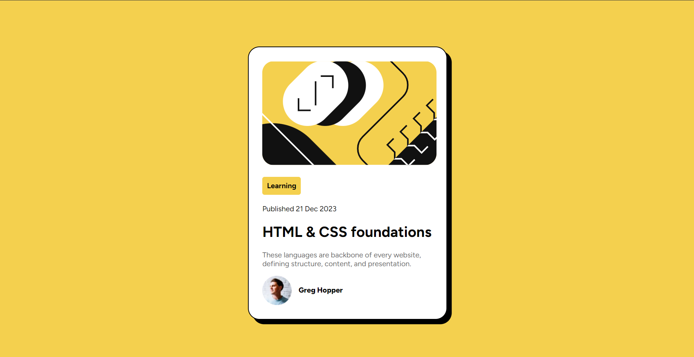

# Frontend Mentor - Blog preview card solution

This is a solution to the [Blog preview card challenge on Frontend Mentor](https://www.frontendmentor.io/challenges/blog-preview-card-ckPaj01IcS). Frontend Mentor challenges help you improve your coding skills by building realistic projects.

### Screenshot

### Built with

- Semantic HTML5 markup
- CSS custom properties
- Flexbox

### What I learned

I learned that an .svg file can be used directly as an image. I also explored flex-direction, understanding that placing any tags within a div set to display: flex aligns them side-by-side, as flex-direction defaults to row.

### Continued development

Should learn about CSS grid and position attribute.

## Author

- Frontend Mentor - [@SriMidhinesh](https://www.frontendmentor.io/profile/SriMidhinesh)